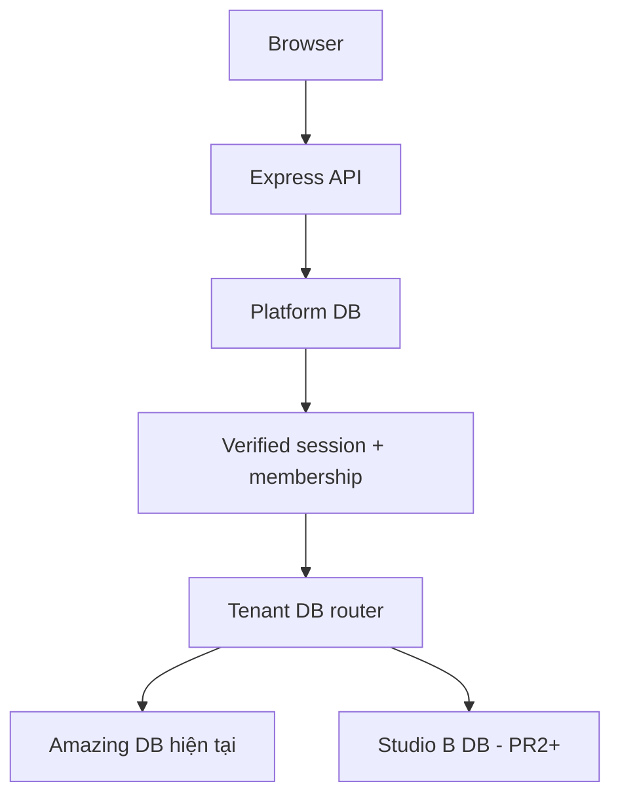

# Multi-tenant architecture

## Quyết định

SaaS dùng mô hình **control-plane database + database-per-tenant**. Không thêm
`tenant_id` vào mọi bảng nghiệp vụ trong một database dùng chung.

Platform DB chỉ chứa control-plane data:

- `platform_users`, `auth_identities`
- `tenants`, `tenant_memberships`, `tenant_invitations`
- `tenant_database_registry`, `sessions`, `platform_audit_logs`
- `plans`, `subscriptions`, `provisioning_jobs`

Booking, customer, service, payment, debt, calendar, rental và dữ liệu vận hành
luôn nằm trong tenant database.

## Amazing Studio là tenant đầu tiên

Tenant có `name=Amazing Studio`, `slug=amazing-studio`, `status=active`.
Registry lưu metadata không nhạy cảm và `secret_ref=env:DEFAULT_TENANT_DATABASE_URL`.
Database production hiện tại được giữ nguyên; không copy, migrate nghiệp vụ,
seed hay tạo database trắng thay thế.

PR2 dùng router database-per-tenant: active tenant lấy duy nhất từ server session,
registry trỏ tới secret env allowlist, rồi metadata host/database/role được đối
chiếu trước khi mở pool. Thiếu/sai registry, secret, metadata hoặc kết nối đều trả
503; tuyệt đối không fallback sang Amazing. Unique index `(host_ref,
database_name)` ngăn hai tenant đăng ký cùng database vật lý.

## Identity và quyền

Hai lớp quyền độc lập:

| Lớp | Role | Phạm vi |
|---|---|---|
| Platform | `PLATFORM_OWNER` | Chủ phần mềm, tenant/provisioning toàn nền tảng |
| Platform | `PLATFORM_ADMIN` | Quản trị SaaS được cấp sau này |
| Tenant | `OWNER` | Toàn quyền studio, member/role/session |
| Tenant | `ADMIN` | Quản trị studio; invite STAFF khi OWNER cấp permission |
| Tenant | `STAFF` | Chỉ module nghiệp vụ được cấp; không quản trị membership |

`staff.role/roles` trong tenant DB vẫn là vai trò nghiệp vụ. Membership liên kết
bằng `tenant_staff_id`; không có foreign key xuyên database. API compatibility
giữ `user.id = tenant_staff_id`, đồng thời trả riêng `platformUserId` và
`tenantMembershipId`.

Không thể sửa `PLATFORM_OWNER` qua member API. Thay role/khóa OWNER cuối cùng bị
chặn trong transaction có advisory lock.

## Session và request boundary

- Cookie opaque 256-bit; database chỉ lưu SHA-256 hash.
- Cookie production: HttpOnly, Secure, SameSite=Lax, Path `/`, không set Domain.
- Session rotate sau login; logout hiện tại, logout-all và revoke từng session.
- Thu hồi do đổi role/khóa thành viên được scope theo membership của studio bằng
  `auth_version` và `sessions_revoked_at`; quản trị studio A không làm đăng xuất
  phiên đang hoạt động hợp lệ của cùng người dùng tại studio B.
- Mỗi request kiểm tra lại session, platform user, tenant, membership và tenant
  staff còn active.
- Tenant lấy từ server session; body/query/header client không được dùng để chọn DB.
- `X-Tenant-Id` của upload queue chỉ là assertion chống request cũ sau khi switch;
  mismatch trả `TENANT_CONTEXT_MISMATCH`, không bao giờ dùng header để route.
- Unsafe business request được bảo vệ bằng SameSite + exact same-origin check;
  auth/member mutation còn yêu cầu CSRF token riêng.
- API nghiệp vụ mặc định-deny; public routes được allowlist theo method + exact path.
- Platform DB hoặc tenant DB lỗi trả lỗi rõ ràng và fail closed.

Legacy JWT bridge 60 giây chỉ tồn tại bên trong request để route cũ tiếp tục dùng
`verifyToken`; token không trả frontend, không lưu localStorage và không log.
Mọi truy vấn `pool`/Drizzle của request được dispatch qua immutable
`AsyncLocalStorage` tenant context. Platform mode mà thiếu context sẽ throw thay
vì dùng `DATABASE_URL` mặc định.

## Frontend cache isolation

React Query cache được xóa trước khi render user/tenant mới ở login, logout và
studio switch; cây runtime remount theo user/tenant/membership/role/status. Upload
queue, localStorage và IndexedDB được namespace theo cùng scope; queue cũ bị abort
và callback cũ không được apply sau khi đổi studio.

## Background job, cache và media

- Scheduler liệt kê tenant `active`/`trial`, acquire lease riêng cho từng lượt và
  bỏ qua tenant lỗi mà không chuyển job sang database khác.
- Cache dữ liệu nghiệp vụ, SSE và idempotency key phải chứa tenant scope; staff ID
  hoặc object ID không được xem là duy nhất toàn nền tảng.
- Object mới nằm dưới `tenants/<tenant-id>/...`. Path legacy không prefix chỉ được
  Amazing Studio đọc trong giai đoạn chuyển tiếp; path traversal và tenant mismatch
  bị từ chối.
