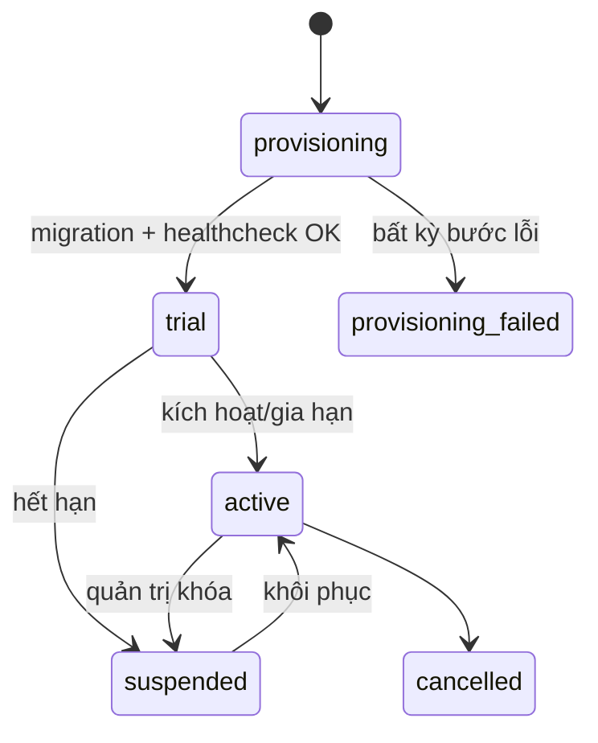

# Tenant provisioning design (PR3)

Tài liệu này mô tả foundation; PR1 chưa tạo database/role tenant mới và chưa mở
self-service signup.

## Input PLATFORM_OWNER

- Tên studio và slug duy nhất
- Gmail OWNER
- Plan
- Số ngày trial

## State machine

## Job idempotent dự kiến

1. Tạo tenant ở `provisioning` và provisioning job có correlation ID.
2. Tạo PostgreSQL role riêng với password sinh ngẫu nhiên trong secret manager.
3. Tạo database riêng, owner là provisioning role; runtime role chỉ có quyền tối
   thiểu trên database đó.
4. Ghi registry bằng reference/encrypted secret, không lưu URL/password rõ.
5. Chạy tenant migration chuẩn theo journal/checksum.
6. Tạo invitation `OWNER` cho Gmail đã nhập.
7. Health check bằng runtime role, kiểm schema version.
8. Chỉ chuyển `trial`/`active` sau khi toàn bộ bước thành công.

Mỗi step ghi `provisioning_jobs.step`, attempt count và error code đã lọc secret.
Retry đọc trạng thái thực tế trước khi tạo tài nguyên; không tạo database/role
trùng. Failure không được đánh tenant active. Cleanup chỉ xóa tài nguyên đã tạo
trong cùng job, sau khi xác nhận không có business data; nếu không chắc, chuyển
`cleanup_required` để người vận hành xử lý.

## Isolation tests PR2/PR3

- Role tenant A không CONNECT database B.
- Session tenant A gửi ID booking/customer/payment của B nhận 403/404.
- Sửa tenant ID trong body/query/header không đổi pool.
- Pool/health failure tenant A không fallback sang tenant khác.
- Pool manager có max connections, idle timeout, LRU/idle close và per-tenant
  circuit breaker để số tenant không làm cạn PostgreSQL.

## Backup/runbook

Mỗi tenant cần backup, retention, restore drill và export riêng. Restore không
được ghi đè tenant khác; tenant phải suspended trong cửa sổ restore. Delete tenant
là workflow nhiều bước, có grace period và explicit approval, không phải thao tác
trực tiếp từ nút UI.
